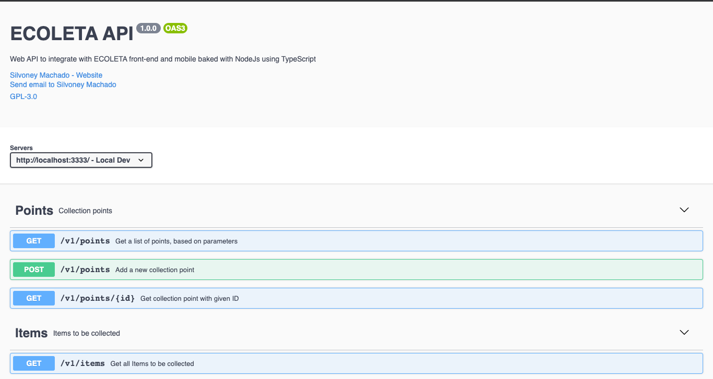
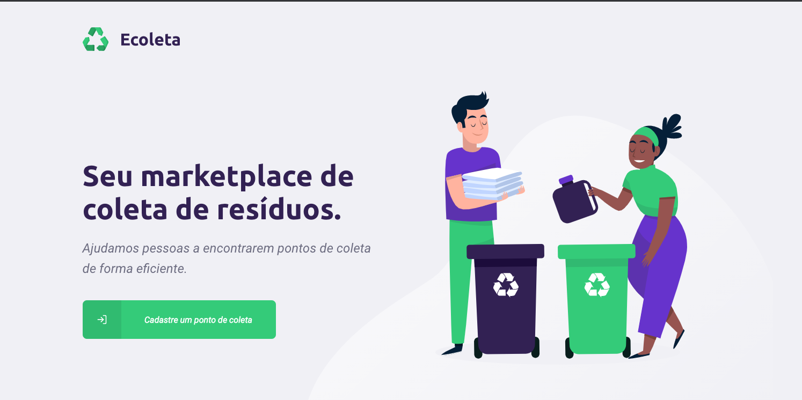
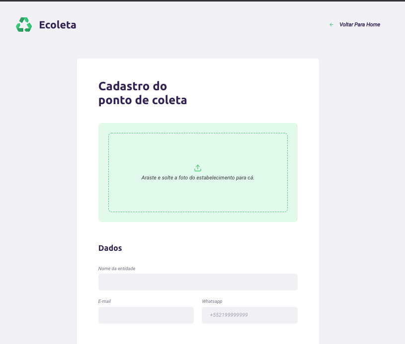
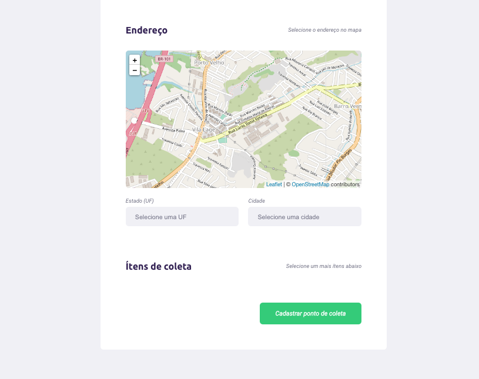
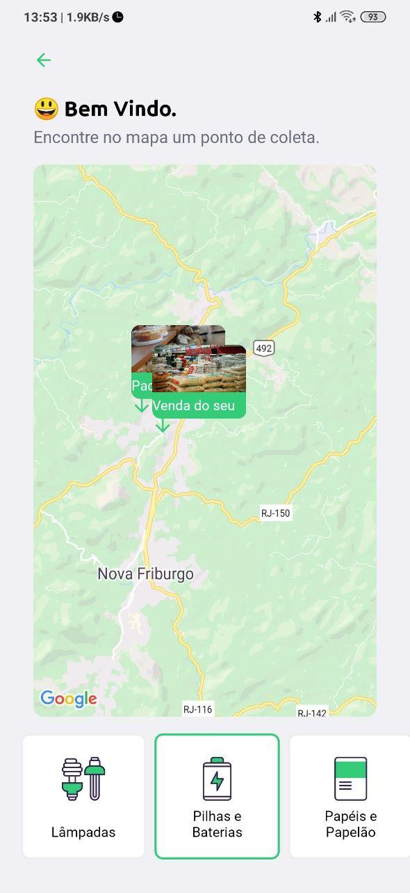
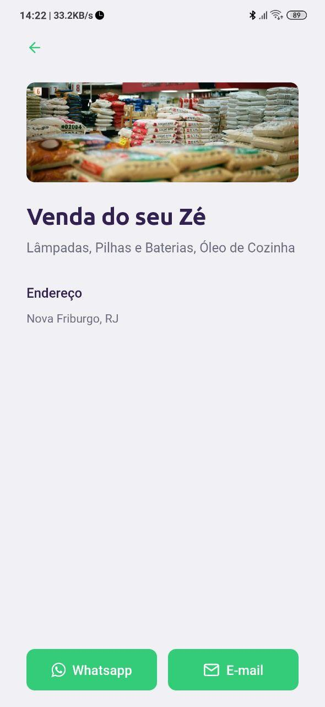

# Next Level Week #1 - Ecoleta :rocket:

  

  

  

  

  <a href="#Web-API">API</a>&nbsp;&nbsp;&nbsp;|&nbsp;&nbsp;&nbsp;
  <a href="#SPA">SPA - FrontEnd</a>&nbsp;&nbsp;&nbsp;|&nbsp;&nbsp;&nbsp;
  <a href="#App-mobile">App mobile</a>&nbsp;&nbsp;&nbsp;|&nbsp;&nbsp;&nbsp;
  <a href="#License">License</a>

## Next Level Week - Rocketseat - Node, ReactJs, React Native with expo

- This week, we created a full stack project that aims to mediate waste collection between entities/local businesses and customers/population.
   - We've used:
   - NodeJS in back-end
   - ReactJS in front-ent
   - ReactNative with expo in app mobile 
## Let's check it out:
### Web API 
#### [NodeJS](https://nodejs.org/) + [Express](https://expressjs.com/) + [Knex.JS](http://knexjs.org/) + [Typescript](https://www.typescriptlang.org/) = 💖
   - Documentation wih swagger
   - Versioning
   - Validation
   - Screen:
      

### SPA
#### [ReactJS](https://reactjs.org/) + [Typescript](https://www.typescriptlang.org/)
   - Maps -> [LeafLet](https://leafletjs.com)
   - Geolocation
   - Drag and Drop Image
   - Internacionalization (soon)
   - Screens:
         
         
         

### App mobile
#### [React Native](https://reactnative.dev/) + [Expo](https://expo.io/) + [Typescript](https://www.typescriptlang.org/)
   - Maps -> Google Maps Native
   - Geolocation
   - Whatsapp Integration
   - Email integration
   - Screens:  
         
         
         

### License

This project has GLP3 license. Look at the details in [LICENSE](./LICENSE).
